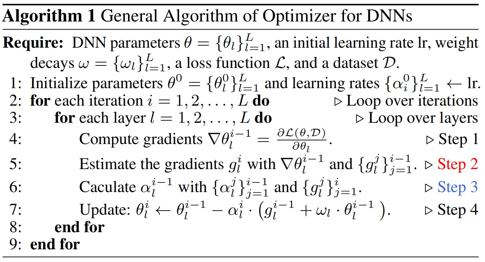
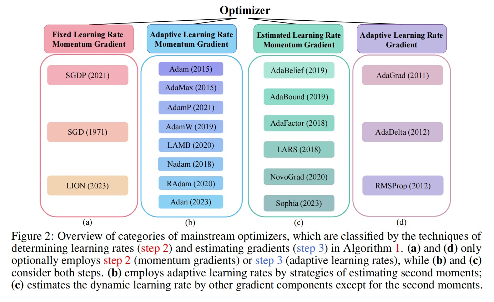

# Awesome-optimizer-PyTorch

Welcome to this repository, a meticulously curated collection of optimization algorithms implemented in PyTorch, designed to cater to the diverse needs of the machine learning research community.

If this repository has been helpful to you, please consider giving it a ⭐️ to show your support. Thank you! ☺️

## Introduction to the Repository

In the realm of machine learning, the choice of an optimizer is as crucial as the architecture of the model itself. This repository aims to provide a comprehensive exploration of various optimization algorithms, with a focus on their implementation and application in PyTorch, facilitating researchers and practitioners in making informed decisions for their projects.

### Awesome Optimizers

<strong>Click to Expand</strong>

<h3>Awesome Optimizers</h3>

Here is a list of some popular optimizers and their corresponding papers:

| Optimizer Name | Paper | Year |
|----------------|-------|------|
| SGD | [On the importance of initialization and momentum in deep learning](https://www.cs.toronto.edu/~hinton/absps/momentum.pdf) | 1999 |
| RMSprop | [Lecture 6.5 - rmsprop, COURSERA: Neural Networks for Machine Learning](https://www.cs.toronto.edu/~tijmen/csc321/slides/lecture_slides_lec6.pdf) | 2012 |
| AdaGrad | [Adaptive Subgradient Methods for Online Learning and Stochastic Optimization](http://www.jmlr.org/papers/volume12/duchi11a/duchi11a.pdf) | 2011 |
| AdaDelta | [ADADELTA: An Adaptive Learning Rate Method](https://arxiv.org/abs/1212.5701) | 2012 |
| Rprop | [Rprop - A Fast Adaptive Learning Algorithm](http://citeseerx.ist.psu.edu/viewdoc/summary?doi=10.1.1.52.4576) | 2000 |
| Adam | [Adam: A Method for Stochastic Optimization](https://arxiv.org/abs/1412.6980) | 2014 |
| AdamW | [Decoupled Weight Decay Regularization](https://arxiv.org/abs/1711.05101) | 2017 |
| SWATS | [Improving Generalization Performance by Switching from Adam to SGD](https://arxiv.org/abs/1712.07628) | 2017 |
| RAdam | [On the Variance of the Adaptive Learning Rate and Beyond](https://arxiv.org/abs/1908.03265) | 2019 |
| NAdam | [Incorporating Nesterov Momentum into Adam](https://openreview.net/forum?id=OM0jvwB8jIp57ZJjtNEZ) | 2019 |
| NovoGrad | [Stochastic Gradient Methods with Layer-wise Adaptive Moments for Training of Deep Networks](https://arxiv.org/abs/1905.11286) | 2019 |
| AdaBound | [Adaptive Gradient Methods with Dynamic Bound of Learning Rate](https://arxiv.org/abs/1902.09843) | 2019 |
| AdaBelief | [AdaBelief Optimizer: Adapting Stepsizes by the Belief in Observed Gradients](https://arxiv.org/abs/2010.07468) | 2020 |
| AdaFactor | [AdaFactor: Adaptive Learning Rates with Sublinear Memory Cost](https://arxiv.org/abs/1804.04235) | 2018 |
| Adahessian | [ADAHESSIAN: An Adaptive Second Order Optimizer for Machine Learning](https://arxiv.org/abs/2006.00719) | 2020 |
| AdaMod | [AdaMod: An Adaptive Momentum Method for Stochastic Gradient Descent](https://arxiv.org/abs/1910.12249) | 2019 |
| AdamP | [Slowing Down the Weight Norm Increase in Momentum-based Optimizers](https://arxiv.org/abs/2006.08217) | 2020 |
| AggMo | [Aggregated Momentum: Stability Through Passive Damping](https://arxiv.org/abs/1804.00325) | 2018 |
| Apollo | [Apollo: An Adaptive Parameter-wise Diagonal Quasi-Newton Method for Nonconvex Stochastic Optimization](https://arxiv.org/abs/2009.13586) | 2020 |
| Adan | [Adaptive Nesterov Momentum Algorithm for Faster Optimizing Deep Models](https://arxiv.org/abs/2208.06677) | 2022 |
| AccSGD | [Accelerating Stochastic Gradient Descent via Online Learning to Learn](https://arxiv.org/abs/1807.02259) | 2018 |
| DiffGRAD | [DiffGrad: An Optimization Method for Convolutional Neural Networks](https://arxiv.org/abs/1909.11015) | 2019 |
| MADGRAD | [Adaptive Gradient Methods with Dynamic Bound of Learning Rate](https://arxiv.org/abs/2101.11075) | 2021 |
| PID | [A PID Controller Approach for Stochastic Optimization of Deep Networks](https://arxiv.org/abs/1802.07640) | 2018 |
| QHAdam | [Quasi-hyperbolic momentum and Adam for deep learning](https://arxiv.org/abs/1810.06801) | 2018 |
| QHM | [Quasi-hyperbolic momentum and Adam for deep learning](https://arxiv.org/abs/1810.06801) | 2018 |
| SAM | [Sharpness-Aware Minimization for Efficiently Improving Generalization](https://arxiv.org/abs/2010.01412) | 2020 |
| Shampoo | [Shampoo: Preconditioned Stochastic Tensor Optimization](https://arxiv.org/abs/1802.09568) | 2018 |
| Yogi | [Adaptive Methods for Nonconvex Optimization](https://papers.nips.cc/paper/8186-adaptive-methods-for-nonconvex-optimization.pdf) | 2018 |
| LION | [LION: Lévy-inspired Optimizer for Deep Learning](https://arxiv.org/abs/2102.07227) | 2021 |
| LARS | [Large Batch Training of Convolutional Networks](https://arxiv.org/abs/1708.03888) | 2017 |
| LAMB | [Large Batch Optimization for Deep Learning: Training BERT in 76 minutes](https://arxiv.org/abs/1904.00962) | 2019 |
| Sophia | [Sophia: A Scalable Stochastic Second-order Optimizer for Language Model Pre-training](https://arxiv.org/abs/2305.14342) | 2023 |
| Lookahead | [Lookahead Optimizer: k steps forward, 1 step back](https://arxiv.org/abs/1907.08610) | 2019 |
| Ranger | [Ranger: A Hybrid Optimizer for Deep Learning](https://medium.com/@lessw/new-deep-learning-optimizer-ranger-synergistic-combination-of-radam-lookahead-for-the-best-of-2dc83f79a48d) | 2019 |
| SGDP | [Slowing Down the Weight Norm Increase in Momentum-based Optimizers](https://arxiv.org/abs/2006.08217) | 2020 |

### Optimizer Paradigm Definition

<strong>Click to Expand</strong>

**Algorithm: General Algorithm of Optimizer for DNNs**

**Input:**
- DNN parameters $\theta = \{\theta_l\}_{l=1}^{L}$
- Initial learning rate $\text{lr}$
- Weight decays $\omega = \{\omega_l\}_{l=1}^{L}$
- Loss function $\mathcal{L}$
- Dataset $\mathcal{D}$

**Initialization:**
- Parameters $\theta^{0} = \{\theta_{l}^{0}\}_{l=1}^{L}$
- Learning rates $\{\alpha_i^0\}_{l=1}^{L} \leftarrow \text{lr}$

**Procedure:**

### Our Latest Work: A Decade’s Battle on the Bias of Vision Backbone and Optimizer

<strong>Click to Expand</strong>

<h3>A Decade’s Battle on the Bias of Vision Backbone and Optimizer</h3>

The past decade has witnessed rapid progress in vision backbones and an evolution of deep optimizers from SGD to Adam variants. This paper, for the first time, delves into the relationship between vision network design and optimizer selection. We conduct comprehensive benchmarking studies on mainstream vision backbones and widely-used optimizers, revealing an intriguing phenomenon termed backbone-optimizer coupling bias (BOCB). Notably, classical ConvNets, such as VGG and ResNet, exhibit a marked co-dependency with SGD, while modern architectures, including ViTs and ConvNeXt, demonstrate a strong coupling with optimizers with adaptive learning rates like AdamW. More importantly, we uncover the adverse impacts of BOCB on popular backbones in real-world practice, such as additional tuning time and resource overhead, which indicates the remaining challenges and even potential risks. Through in-depth analysis and apples-to-apples comparisons, however, we surprisingly observe that specific types of network architecture can significantly mitigate BOCB, which might serve as promising guidelines for future backbone design. We hope this work as a kick-start can inspire the community to further question the long-held assumptions on vision backbones and optimizers, consider BOCB in future studies, and thus contribute to more robust, efficient, and effective vision systems. It is time to go beyond those usual choices and confront the elephant in the room. The source code and models are publicly available.

**Backbone-Optimizer Coupling Bias (BOCB)** is a phenomenon we observed during the bench-marking, which arises from the intricate interplay between the design principles of vision backbones and the inherent properties of optimizers.

Code: https://github.com/Westlake-AI/Backbone-vs-Optimizer

### Visualizing Performance Differences

To illustrate the performance differences of 20 optimizers across various vision backbones under optimal parameter settings, we have included the figure . This figure provides a clear visual representation of how different optimizers perform in different scenarios.

Additionally, we have categorized classic optimizers into four main types, as shown in the following image:

This classification helps in understanding the underlying principles and applications of these optimizers.

### Contribution

The main maintainer is Juanxi Tian (@tianshijing). 

  

Future contributors are welcome, and feel free to send pull requests in hopes that Awesome-Optimizer can become a more mature toolbox in the machine learning community.

[Back to Top]
---

