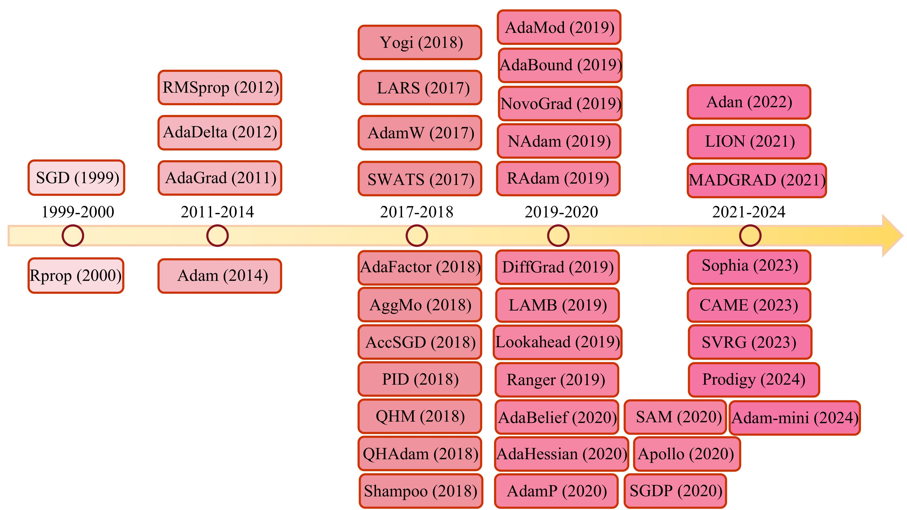

# Awesome-Optimizers

  

 

Welcome to Awesome Optimizers, a meticulously curated collection of optimization algorithms implemented in PyTorch, designed to serve the diverse needs of the machine learning research community.

If this repository has been helpful to you, please consider giving it a ⭐️ to show your support. Your support helps us reach more researchers and contributes to the growth of this resource. Thank you! ☺️

## Table of Contents

- [Introduction](#introduction)
- [Awesome Optimizers](#awesome-optimizers)
- [Optimizer Paradigm Definition](#optimizer-paradigm-definition)
- [Our Latest Work: A Decade’s Battle on the Bias of Vision Backbone and Optimizer](#our-latest-work-a-decades-battle-on-the-bias-of-vision-backbone-and-optimizer)
- [Benchmark](#benchmark)
- [Four categories of optimizers](#four-categories-of-optimizers)
- [Recommended Hyperparameter Settings](#recommended-hyperparameter-settings)
- [Contribution](#contribution)
## Introduction

**In the domain of machine learning, the selection of an appropriate optimizer is of equal significance to the architectural design of the model itself.**

We have meticulously assembled a compendium of preeminent optimizers from the recent scholarly landscape, complemented by lucid roadmaps and pedagogical tutorial notebooks. Our insights, garnered from active engagement in pertinent projects, further enrich this repository. We warmly welcome contributions to this project, including the latest optimizers, tutorial notebooks, or any other valuable resources that can benefit researchers in our community.

We present a meticulously curated roadmap of optimizers, as depicted in the 

This roadmap is continuously updated to reflect the latest advancements. Should you identify any errors or omissions in this repository, please do not hesitate to open an issue or submit a pull request. Our ongoing survey is in the process of being updated, and this represents the most current iteration.

For those seeking to explore the interconnections among relevant papers, we recommend utilizing [Connected Papers](https://www.connectedpapers.com/), a tool that visualizes the academic landscape through a graph representation. To export a paper's BibTeX citation, consult the paper's [arXiv](https://arxiv.org/) or [Semantic Scholar](https://www.semanticscholar.org/) entry for a professionally formatted reference.

## Awesome Optimizers
<!-- 

<strong>Click to Expand</strong>
-->

<h3>Awesome Optimizers List</h3>

Here is a list of some popular optimizers and their corresponding papers:

| Optimizer Name | Paper | Year | Advantages |
|----------------|-------|------|------------|
| SGD | [On the importance of initialization and momentum in deep learning](https://www.cs.toronto.edu/~hinton/absps/momentum.pdf) | 1999 | Simple and effective; foundational for many other optimizers. |
| Rprop | [Rprop - A Fast Adaptive Learning Algorithm](http://citeseerx.ist.psu.edu/viewdoc/summary?doi=10.1.1.52.4576) | 2000 | Adaptive step sizes per parameter; fast convergence for small networks. |
| AdaGrad | [Adaptive Subgradient Methods for Online Learning and Stochastic Optimization](http://www.jmlr.org/papers/volume12/duchi11a/duchi11a.pdf) | 2011 | Adaptive learning rates; effective for sparse data. |
| RMSprop | [Lecture 6.5 - rmsprop, COURSERA: Neural Networks for Machine Learning](https://www.cs.toronto.edu/~tijmen/csc321/slides/lecture_slides_lec6.pdf) | 2012 | Adaptive learning rates; suitable for non-stationary objectives. |
| AdaDelta | [ADADELTA: An Adaptive Learning Rate Method](https://arxiv.org/abs/1212.5701) | 2012 | Adaptive learning rates without manual tuning; addresses AdaGrad's diminishing learning rates. |
| Adam | [Adam: A Method for Stochastic Optimization](https://arxiv.org/abs/1412.6980) | 2014 | Combines best properties of AdaGrad and RMSprop; widely used and effective. |
| LARS | [Large Batch Training of Convolutional Networks](https://arxiv.org/abs/1708.03888) | 2017 | Enables large batch training with stability; improves training efficiency. |
| AdamW | [Decoupled Weight Decay Regularization](https://arxiv.org/abs/1711.05101) | 2017 | Fixes weight decay regularization in Adam; improves generalization. |
| SWATS | [Improving Generalization Performance by Switching from Adam to SGD](https://arxiv.org/abs/1712.07628) | 2017 | Hybrid approach combining Adam and SGD; improves generalization. |
| Shampoo | [Shampoo: Preconditioned Stochastic Tensor Optimization](https://arxiv.org/abs/1802.09568) | 2018 | Preconditions stochastic tensor optimization; improves convergence. |
| QHAdam | [Quasi-hyperbolic momentum and Adam for deep learning](https://arxiv.org/abs/1810.06801) | 2018 | Combines quasi-hyperbolic terms with Adam; balances momentum and adaptivity. |
| QHM | [Quasi-hyperbolic momentum and Adam for deep learning](https://arxiv.org/abs/1810.06801) | 2018 | Introduces quasi-hyperbolic momentum; balances Nesterov momentum and SGD. |
| Yogi | [Adaptive Methods for Nonconvex Optimization](https://papers.nips.cc/paper/8186-adaptive-methods-for-nonconvex-optimization.pdf) | 2018 | Improved update rule for adaptive methods; handles nonconvex optimization better. |
| AdaFactor | [AdaFactor: Adaptive Learning Rates with Sublinear Memory Cost](https://arxiv.org/abs/1804.04235) | 2018 | Reduces memory usage compared to Adam; suitable for large models. |
| AggMo | [Aggregated Momentum: Stability Through Passive Damping](https://arxiv.org/abs/1804.00325) | 2018 | Uses multiple momentum terms; improves stability and convergence. |
| PID | [A PID Controller Approach for Stochastic Optimization of Deep Networks](https://arxiv.org/abs/1802.07640) | 2018 | Employs PID control principles; improves convergence and stability. |
| AccSGD | [Accelerating Stochastic Gradient Descent via Online Learning to Learn](https://arxiv.org/abs/1807.02259) | 2018 | Accelerates SGD by learning to adapt the learning rate online. |
| AdaBound | [Adaptive Gradient Methods with Dynamic Bound of Learning Rate](https://arxiv.org/abs/1902.09843) | 2019 | Bounds the learning rate dynamically; combines benefits of adaptive and SGD methods. |
| LAMB | [Large Batch Optimization for Deep Learning: Training BERT in 76 minutes](https://arxiv.org/abs/1904.00962) | 2019 | Enables large batch training for BERT; improves training efficiency. |
| Lookahead | [Lookahead Optimizer: k steps forward, 1 step back](https://arxiv.org/abs/1907.08610) | 2019 | Combines with other optimizers to improve convergence and stability. |
| RAdam | [On the Variance of the Adaptive Learning Rate and Beyond](https://arxiv.org/abs/1908.03265) | 2019 | Rectifies variance of the adaptive learning rate; improves stability. |
| AdaMod | [AdaMod: An Adaptive Momentum Method for Stochastic Gradient Descent](https://arxiv.org/abs/1910.12249) | 2019 | Modulates the momentum term adaptively; improves stability and convergence. |
| Ranger | [Ranger: A Hybrid Optimizer for Deep Learning](https://medium.com/@lessw/new-deep-learning-optimizer-ranger-synergistic-combination-of-radam-lookahead-for-the-best-of-2dc83f79a48d) | 2019 | Combines RAdam and Lookahead; improves convergence and generalization. |
| NAdam | [Incorporating Nesterov Momentum into Adam](https://openreview.net/forum?id=OM0jvwB8jIp57ZJjtNEZ) | 2019 | Combines Nesterov momentum with Adam; improves convergence. |
| NovoGrad | [Stochastic Gradient Methods with Layer-wise Adaptive Moments for Training of Deep Networks](https://arxiv.org/abs/1905.11286) | 2019 | Uses layer-wise adaptive moments; efficient for deep networks. |
| DiffGRAD | [DiffGrad: An Optimization Method for Convolutional Neural Networks](https://arxiv.org/abs/1909.11015) | 2019 | Differentiates the gradient history; improves convergence. |
| Adahessian | [ADAHESSIAN: An Adaptive Second Order Optimizer for Machine Learning](https://arxiv.org/abs/2006.00719) | 2020 | Uses Hessian information adaptively; suitable for nonconvex optimization. |
| AdaBelief | [AdaBelief Optimizer: Adapting Stepsizes by the Belief in Observed Gradients](https://arxiv.org/abs/2010.07468) | 2020 | Adapts stepsizes based on the belief in observed gradients; improves convergence. |
| AdamP | [Slowing Down the Weight Norm Increase in Momentum-based Optimizers](https://arxiv.org/abs/2006.08217) | 2020 | Mitigates weight norm increase; improves generalization. |
| SGDP | [Slowing Down the Weight Norm Increase in Momentum-based Optimizers](https://arxiv.org/abs/2006.08217) | 2020 | Prevents excessive weight norm increase; improves stability. |
| Apollo | [Apollo: An Adaptive Parameter-wise Diagonal Quasi-Newton Method for Nonconvex Stochastic Optimization](https://arxiv.org/abs/2009.13586) | 2020 | Adaptive quasi-Newton method; efficient for nonconvex optimization. |
| SAM | [Sharpness-Aware Minimization for Efficiently Improving Generalization](https://arxiv.org/abs/2010.01412) | 2020 | Minimizes sharpness of the loss landscape; improves generalization. |
| MADGRAD | [Adaptive Gradient Methods with Dynamic Bound of Learning Rate](https://arxiv.org/abs/2101.11075) | 2021 | Dynamically bounds the learning rate; improves stability. |
| LION | [LION: Lévy-inspired Optimizer for Deep Learning](https://arxiv.org/abs/2102.07227) | 2021 | Inspired by Lévy flights; explores the loss landscape efficiently. |
| Adan | [Adaptive Nesterov Momentum Algorithm for Faster Optimizing Deep Models](https://arxiv.org/abs/2208.06677) | 2022 | Adaptive Nesterov momentum; faster optimization for deep models. |
| CAME | [CAME: Confidence-guided Adaptive Memory Efficient Optimization](https://arxiv.org/abs/2307.02047) | 2023 | Adaptive and memory-efficient; improves optimization with confidence guidance. |
| Sophia | [Sophia: A Scalable Stochastic Second-order Optimizer for Language Model Pre-training](https://arxiv.org/abs/2305.14342) | 2023 | Scalable second-order optimizer; efficient for large-scale pre-training. |
| SVRG | [A Coefficient Makes SVRG Effective](https://arxiv.org/abs/2311.05589) | 2023 | Adaptive and memory-efficient, enhancing optimization with a confidence-guided adjustment of variance reduction strength. |
| Prodigy | [Prodigy: An Expeditiously Adaptive Parameter-Free Learner](https://arxiv.org/abs/2306.06101) | 2024 | Prodigy is an adaptive, parameter-free optimizer that dynamically adjusts the learning rate by accurately estimating the distance to the optimal solution, significantly improving convergence speed and solution quality. |
| Adam-mini | [Adam-mini: Use Fewer Learning Rates To Gain More](https://arxiv.org/abs/2406.16793) | 2024 | Reduces the number of learning rates; simplifies hyperparameter tuning. |
| GALORE | [GALORE: Gradient Low-Rank Projection Training](https://arxiv.org/abs/2403.03507) | 2024 | Projects gradients to low-rank subspaces with dynamic switching; memory-efficient. |
| SOAP | [SOAP: Efficient Stochastic Optimization of the Second-Order Loss](https://arxiv.org/abs/2409.11321) | 2025 | Shampoo/Adafactor hybrid that runs AdamW in Shampoo's eigenbasis. |
| SPAM | [SPAM: Spike-Aware Momentum Optimization](https://arxiv.org/abs/2501.06842) | 2025 | Moment resetting + spike-aware clipping + sparse momentum. |
| SWAN | [SWAN: State-Free Learning for Deep Neural Networks](https://arxiv.org/pdf/2412.13148) | 2024 | No optimizer state storage; scales additively (small models) or multiplicatively (large models). |
| APOLLO | [APOLLO: Memory-Efficient Optimization via Low-Rank Gradient Approximation](https://arxiv.org/abs/2412.05270) | 2024 | Low-rank gradient projection with diagonal scaling. |
| AdEMAMix | [AdEMAMix: Adaptive EMA Momentum for Deep Learning](https://arxiv.org/abs/2409.03137) | 2024 | Dual EMA system balances recent/historical gradients. |
| Muon | [Muon: Orthogonal Weight Updates via Newton-Schulz Iteration](https://arxiv.org/abs/2502.16982) | 2024 | Orthogonalizes gradient momentum via Newton-Schulz. |

## Optimizer Paradigm Definition

<strong>Click to Expand</strong>

**Algorithm: General Algorithm of Optimizer for DNNs**

**Input:**
- DNN parameters $\theta = \{\theta_l\}_{l=1}^{L}$
- Initial learning rate $\text{lr}$
- Weight decays $\omega = \{\omega_l\}_{l=1}^{L}$
- Loss function $\mathcal{L}$
- Dataset $\mathcal{D}$

**Initialization:**
- Parameters $\theta^{0} = \{\theta_{l}^{0}\}_{l=1}^{L}$
- Learning rates $\{\alpha_i^0\}_{l=1}^{L} \leftarrow \text{lr}$

**Procedure:**

  

## Our Latest Work: Unveiling the Backbone-Optimizer Coupling Bias in Visual Representation Learning

<strong>Click to Expand</strong>

<h2><a href="https://arxiv.org/abs/2410.06373">Unveiling the Backbone-Optimizer Coupling Bias in Visual Representation Learning</a></h2>

[Siyuan Li](https://lupin1998.github.io/)1,2\*, [Juanxi Tian](https://tianshijing.github.io/)1\*, [Zedong Wang](https://zedongwang.netlify.app/)1\*, [Luyuan Zhang](https://openreview.net/profile?id=~Luyuan_Zhang1)1, [Zicheng Liu](https://pone7.github.io/)1,2\*,[Weiyang Jin]()1, [Yang Liu](https://scholar.google.co.id/citations?user=t1emSE0AAAAJ&hl=zh-CN)3, [Baigui Sun](https://scholar.google.co.id/citations?user=ZNhTHywAAAAJ&hl=zh-CN)3, [Stan Z. Li](https://scholar.google.com/citations?user=Y-nyLGIAAAAJ&hl=zh-CN)1†

1[Westlake University](https://westlake.edu.cn/), 2[Zhejiang University](https://www.zju.edu.cn), 2[Damo Academy](https://damo.alibaba.com/?language=en)

**Abstract**  This paper delves into the interplay between vision backbones and optimizers, unvealing an inter-dependent phenomenon termed backbone-optimizer coupling bias (BOCB). We observe that canonical CNNs, such as VGG and ResNet, exhibit a marked co-dependency with SGD families, while recent architectures like ViTs and ConvNeXt share a tight coupling with the adaptive learning rate ones. We further show that BOCB can be introduced by both optimizers and certain backbone designs and may significantly impact the pre-training and downstream fine-tuning of vision models. Through in-depth empirical analysis, we summarize takeaways on recommended optimizers and insights into robust vision backbone architectures. We hope this work can inspire the community to question long-held assumptions on backbones and optimizers, stimulate further explorations, and thereby contribute to more robust vision systems. The source code and models are publicly available.

**Backbone-Optimizer Coupling Bias (BOCB)** is a phenomenon we observed during the bench-marking, which arises from the intricate interplay between the design principles of vision backbones and the inherent properties of optimizers.

Code: [https://github.com/Westlake-AI/Backbone-vs-Optimizer](https://github.com/Black-Box-Optimization-Coupling-Bias/BOCB)

## Benchmark

<strong>Click to Expand</strong>

### Benchmark of the universal Vision Backbone
To illustrate the performance differences of 20 optimizers across various vision backbones under optimal parameter settings, we have included the figure 

and

These figures provides clear visual representation of how different optimizers perform in different scenarios.

### Benchmark of the LMFlow
In LMFlow, I have contributed a customizable optimization fine-tuning feature, enabling you to freely select an optimizer for testing, with the intention to incorporate additional optimization techniques in forthcoming updates.  
[custom_optimizers](https://github.com/OptimalScale/LMFlow/blob/main/scripts/run_finetune_with_custom_optim.sh)
Below is a comprehensive Benchmark table detailing the fine-tuning of GPT2 with various optimizers on the alpaca dataset (The default hyperparameter setting is num_epoch=0.1. For reference only.). 
  | Optimizer Name | Train Loss |
  |----------------|------------|
  | RMSprop        | 2.4016     |
  | LION-32bit     | 2.4041     |
  | Adam           | 2.4292     |
  | AdamP          | 2.4295     |
  | AdamW          | 2.4469     |
  | AdaFactor      | 2.4543     |
  | AdaBound       | 2.4547     |
  | AdamWScheduleFree       | 2.4677     |
  | Adan           | 2.5063     |
  | NAdam          | 2.5569     |
  | AdaBelief      | 2.5857     |
  | AdaMax         | 2.5924     |
  | RAdam          | 2.6104     |
  | AdaDelta       | 2.6298     |
  | AdaGrad        | 2.8657     |
  | Yogi           | 2.9314     |
  | NovoGrad       | 3.1071     |
  | Sophia         | 3.1517     |
  | LAMB           | 3.2350     |
  | LARS           | 3.3329     |
  | SGDScheduleFree        | 3.3541     |
  | SGDP           | 3.3567     |
  | SGD            | 3.3734     |

## Four categories of optimizers

<strong>Click to Expand</strong>

I have categorized classic optimizers into four main types, as shown in the following image:

  

This classification helps in understanding the underlying principles and applications of these optimizers.

## Recommended Hyperparameter Settings

<strong>Click to Expand</strong>

Herein, we present a set of recommended hyperparameters for use under various visual backbone scenarios. Please note that these suggestions are based on extensive research and empirical findings, and should be considered a useful starting point rather than a one-size-fits-all solution. As with any machine learning application, the optimal hyperparameters may vary depending on the specific characteristics of your dataset and the computational resources available to you. We encourage practitioners to use these recommendations as a foundation and to further fine-tune them to suit their unique requirements and constraints.

## Contribution

The main maintainer is Juanxi Tian ([@Juanxi Tian](https://github.com/tianshijing)). 

  

Future contributors are welcome, and feel free to send pull requests in hopes that Awesome-Optimizers can become a more mature toolbox in the machine learning community.

[<a href="#top">back to top</a>]

